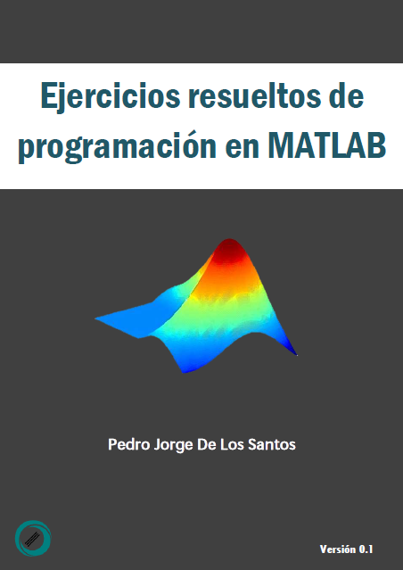

# Ejercicios resueltos de programación en MATLAB

## Contenido

* Parte 1. Programación básica
* Parte 2. Matrices y vectores
* Parte 3. Cadenas de caracteres
* Parte 4. Gráficas
* Parte 5. Matemáticas
* Parte 6. Interfaces gráficas de usuario
* Parte 7. Programación orientada a objetos

  Ejercicios resueltos de programación en MATLAB está licenciada bajo una licencia <a rel="license" href="http://creativecommons.org/licenses/by/4.0/">
(CC BY 4.0)</a> 