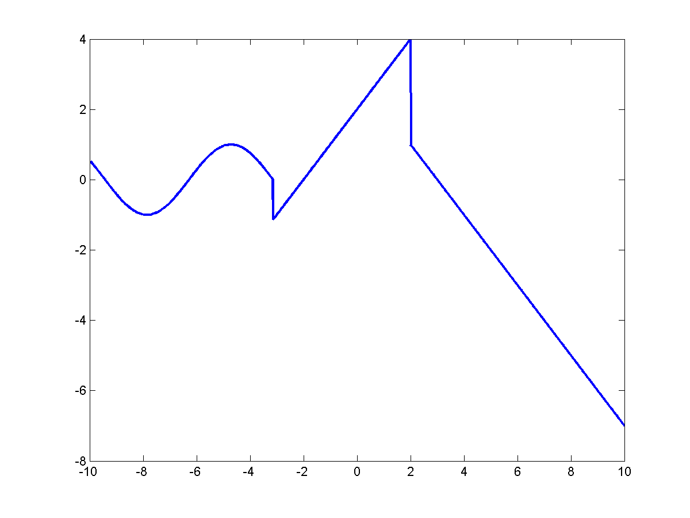

# Gráficas

## Gráfica de una función a trozos

*Escriba un programa que grafique la siguiente función a trozos:*

{$$}
f(x)=\left\{ 
\begin{array}{cc}
\sin (x) & x<-\pi   \\
x+2 & -\pi \le x\le 2  \\
-x+3 & x>2  \\
\end{array} \right.
{/$$}

```matlab
x=-10:0.01:10;
y1=sin(x(x<-pi));
y2=x(x>=-pi & x<=2)+2;
y3=-(x(x>2))+3;
plot(x,[y1 y2 y3],'linewidth',2);
```

{width=60%}


## Gráfica de una desigualdad (inecuación)

*MATLAB no proporciona de manera nativa una función para trazar gráficas
de inecuaciones, por ello el objetivo de este ejercicio es desarrollar
una función llamada inecgraf, cuyos argumentos de entrada sean: la
inecuación dada como una cadena de caracteres y el intervalo en el cual
se graficará (vector de dos elementos).*

```matlab
function inecgraf(I,R)
% Grafica una desigualdad (inecuacion) en un rango
% especificado.
%
% Argumentos de entrada:
%            I    -   Inecuacion
%            R    -   Rango en el cual se trazara la
%                     grafica.
%

set(gca,'NextPlot','add'); 
axis([R(1) R(2) R(1) R(2)]);
dd=(R(2)-R(1))/50;
[x,y]=meshgrid(R(1):dd:R(2));
[f,c]=find(eval(I));
h=zeros(1,length(f));
for i=1:length(f)
        h(i)=plot(x(f(i),c(i)),y(f(i),c(i)),'b*','MarkerSize',2);
end
end
```

## Gráfica de una esfera

*Desarrolle una función `esfera` cuyos parámetros de entrada sean: el
radio, y las coordenadas {$$}x,y,z{/$$} del centro. Con los datos anteriores
trace una esfera, apoyándose en la función `sphere` nativa de MATLAB.*
